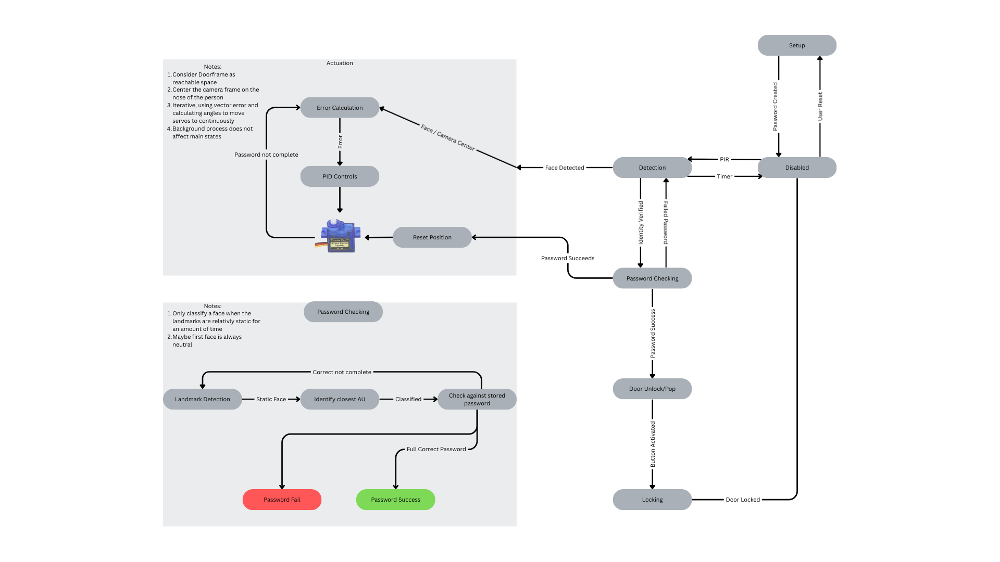

# FaceLock
Design and novel door locking AND opening system which can easily be installed and used in any hinged door frame User creates facial password with specific facial expressions Without using their hands, user can walk up to the door, perform the facial password and the door will unlock The unlocked door pops open for easy access.

# ROS2 Architecture

# State Machine

# Hardware Diagram

