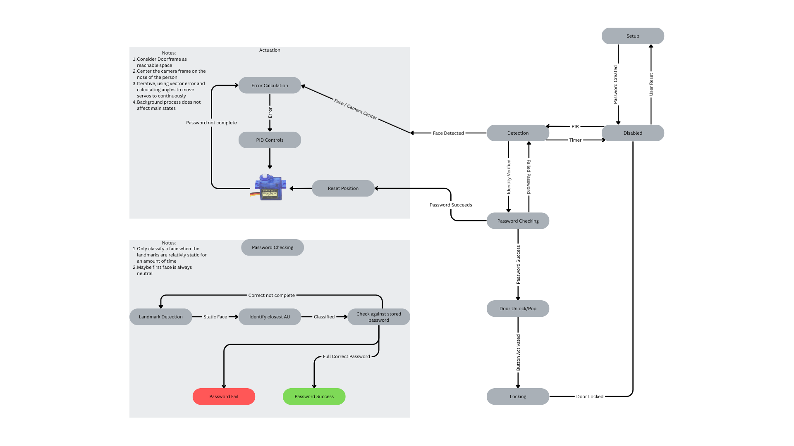

# FaceLock

The goal of this project is to create a handsfree sequence of approaching and entering a door, by utilizing a robotic system to manage facial recognition, a facial password, unlocking the door, and opening the door. 

## Overview

**Key Features:**
- Hands-free operation via facial expression passwords
- Motion-activated (PIR sensor) to save power and maintain privacy
- 2-DOF robotic arm with camera for adaptive face tracking
- Secure deadbolt mechanism with spring-loaded door opener
- Electromagnet holding system for reliability
- ROS2-based architecture with lifecycle management

---

## Architecture & Design

### ROS2 Architecture


### State Machine


### Hardware Diagram


---

## How It Works

### System Flow

1. **Standby State**: The system is disabled, with only the PIR motion sensor active to conserve power.

2. **Motion Detection**: When the PIR sensor detects infrared motion, the system awakens and enables the camera, arm controller, and facial recognition nodes.

3. **Face Tracking**: The 2-DOF robotic arm continuously tracks the person's face using a P-controller. The arm calculates the error between the face center and camera center, then adjusts servo angles to center the face in the frame.

4. **Identity Verification**: The face recognition system compares the detected face's embeddings against the stored identity. If there's a match, the system proceeds to password verification.

5. **Password Verification**: The system monitors facial landmarks (using MediaPipe) and extracts "blendshapes" representing facial action units (e.g., jaw open, eye blink). These are compared sequentially against the saved facial password.

6. **Unlock & Open**: Upon successful password verification, the servo unlocks the deadbolt. Springs then push the door ajar, signaling successful authentication.

7. **Close & Re-lock**: Once the door is pushed closed, an electromagnet holds it in place while the deadbolt is re-extended and locked. The system then returns to standby.

---

## Hardware Components

### Face Recognition & Tracking System

**2-DOF Robotic Arm**
- Two servo motors actuate the arm linkages
- 1080p camera mounted on the end effector
- Integrated LED lights for low-light operation
- PIR motion sensor on the end effector

**Camera & Sensing**
- 1080p resolution for clear facial feature detection
- LED lights enable operation in darker environments
- PIR sensor enables power-efficient motion detection


### Facial Password Storage

**Face Recognition Library**
- Uses Histogram of Oriented Gradients (HOG) for face detection
- Generates 128-dimensional face embeddings using triplet loss training
- Embeddings cluster identities in Euclidean space for reliable few-shot identification
- Stores identity embeddings as `.npy` files in `data/identities/`

**Facial Landmarks & Blendshapes**
- Google's MediaPipe maps 468 facial landmark points
- Extracted blendshapes represent facial action units (jawOpen, leftEyeBlink, mouthPucker, etc.)
- Password sequences are stored as `.npy` files in `data/passwords/`

## Software Architecture

### Core Components

**Face Recognition Node**
- Detects faces in camera frames using HOG
- Generates and compares face embeddings against stored identity
- Sends face location to arm controller
- Identifies blendshapes for password verification
- Runs as a ROS2 Lifecycle Node (can be disabled)

**Arm Controller Node**
- Calculates error between face center and camera center
- Implements P-controller for smooth servo motion
- Updates servo angles at 20 Hz via slew callback
- Manages camera leveling constraint
- Runs as a ROS2 Lifecycle Node (can be disabled)

**Hardware Interface Node**
- Low-level GPIO control via pigpio PWM
- Converts servo angles to pulse widths (1000–2000 μs)
- Manages electromagnet GPIO (HIGH = latched, LOW = released)
- Polls PIR and door-close button inputs at 50 Hz
- Always active (not a lifecycle node)

**State Machine Manager**
- Orchestrates the complete authentication flow
- Manages ROS2 lifecycle node transitions
- Handles timeout logic and error states

**Filtered Blendshapes**
- MediaPipe provides 52+ blendshapes by default, but many are noisy or easily triggered accidentally
- The system filters out unreliable blendshapes to ensure consistent password detection:

```
Filtered Out: eyeLookDownLeft, eyeLookDownRight, eyeLookInLeft, eyeLookInRight,
eyeLookOutLeft, eyeLookOutRight, eyeLookUpLeft, eyeLookUpRight, eyeSquintLeft, 
eyeSquintRight, browDownLeft, browDownRight, mouthDimpleLeft, mouthDimpleRight, 
mouthShrugLower, mouthShrugUpper, mouthStretchLeft, mouthStretchRight, 
mouthRollLower, mouthRollUpper, mouthPressLeft, mouthPressRight, 
mouthLowerDownLeft, mouthLowerDownRight, mouthUpperUpLeft, mouthUpperUpRight, 
browInnerUp
```

- Remaining blendshapes are more reliable for intentional facial expressions

**Power Efficiency via Lifecycle Nodes**
- ROS2 Lifecycle Nodes allow complete state management
- Camera, arm, and face recognition nodes can be fully disabled
- Only the PIR sensor GPIO remains active in standby
- Dramatically reduces power consumption when no one is at the door

---

## State Machine Details

```
DISABLED
  ↓ (PIR motion detected)
ACTIVE → TRACKING FACE
  ↓ (identity verified)
PASSWORD VERIFICATION
  ↓ (password correct)
UNLOCK DOOR
  ↓ (springs push door ajar)
OPEN
  ↓ (user pushes door closed, door-close button pressed)
ELECTROMAGNET HOLDS CLOSED
  ↓ (deadbolt re-locked)
DISABLED
```

### State Transitions

- **Timeout Logic**: If no face is detected for N seconds, or PIR motion stops, system returns to DISABLED
- **Failed Password**: Returns to PASSWORD VERIFICATION state, allowing retry
- **Door Position**: Door-close button sensor ensures door is fully closed before re-locking

---

## Setup & Configuration

### Development Environment

**Prerequisites**
- ROS2 (Humble or compatible version)
- Python 3.10+
- OpenCV
- Google MediaPipe
- pigpio (for GPIO control)

**Installation**

1. Clone the repository and enter the workspace:
   ```bash
   cd /workspaces/FaceLock
   ```

2. Set up ROS2 environment:
   ```bash
   source /opt/ros/humble/setup.bash
   ```

3. Install dependencies:
   ```bash
   cd src/face_lock
   pip install -r requirements.txt
   ```

4. Build the workspace:
   ```bash
   cd /workspaces/FaceLock
   colcon build
   source install/setup.bash
   ```

### Training Your Facial Identity & Password

1. **Enter Setup Mode**: Run the setup script to enroll your face and create your facial password

2. **Save Identity Images**: Capture multiple images of your face from different angles
   - Images are stored in `src/face_lock/data/identities/`
   - The system creates a face embedding database for few-shot identification

3. **Record Facial Password**: Perform a sequence of facial expressions in order (e.g., raise eyebrows → blink → open mouth → smile)
   - Each step is saved as a blendshape state
   - Password is stored in `src/face_lock/data/passwords/`

### Running Individual Components

Test individual hardware components without the full system:

```bash
# Test servo motors
python test_servo.py

# Test PIR motion sensor
python test_pir.py

# Test electromagnet
python test_magnet.py

# Test door button
python test_button.py

# Test robotic arm
python test_arm.py

# Run all tests
python run_all.py
```

### Running the Full System

```bash
# Start the ROS2 launch file
ros2 launch face_lock startup.launch.py
```


## CAD Models

3D models and design files for manufacturing the mechanical components (arm linkages, servo mounts, deadbolt housing, spring assemblies, etc.) will be available in the `cad_models/` folder.